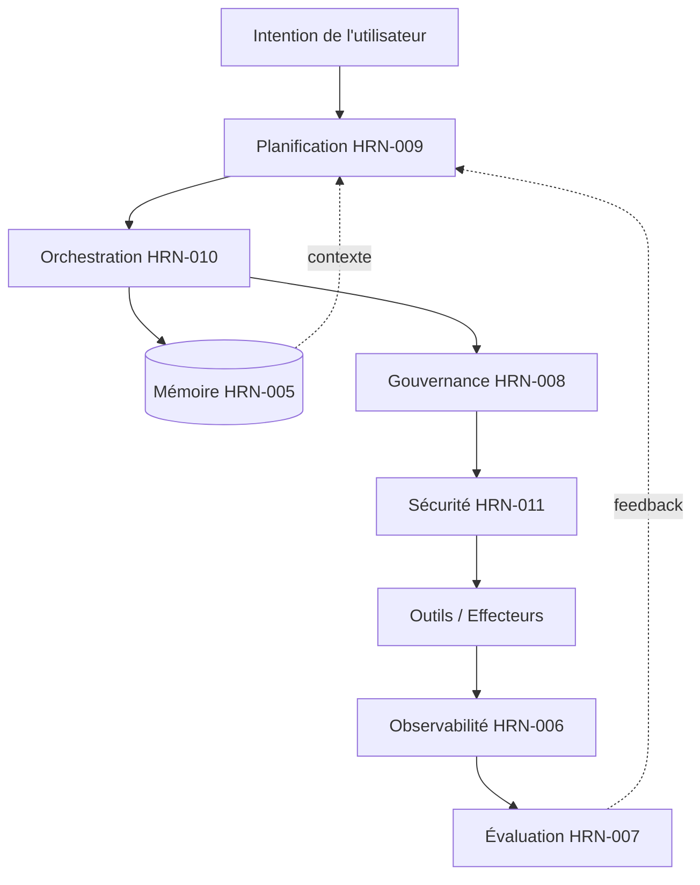

# Études de cas en Harness Engineering

## Résumé exécutif

Ce chapitre ancre les couches abstraites du harness dans trois récits de bout en bout. Chacun est un **composite représentatif et anonymisé** — synthétisé à partir de modèles courants de l'industrie, et non le récit d'un déploiement spécifique nommé, ni une source de métriques vérifiées. L'objectif est de montrer comment les couches interagissent sous charge : comment la mémoire, la planification, l'orchestration, la gouvernance, la sécurité et l'observabilité cessent d'être des chapitres distincts pour devenir un système unique. Lus ensemble, ces cas renforcent la thèse selon laquelle la fiabilité des agents d'entreprise est une propriété d'ingénierie du harness, et non une propriété émergente du modèle.

## Concepts clés

- **Étude de cas composite :** un scénario illustratif assemblé à partir de modèles récurrents du monde réel, explicitement distinct d'un déploiement unique vérifié.
- **De bout en bout :** couvrant de l'ingestion de l'intention jusqu'à l'action vérifiée et gouvernée, et l'observation.
- **Interaction des couches du harness :** la manière dont la mémoire, la planification, l'orchestration, la gouvernance, la sécurité et l'observabilité se composent.

## Définition

> Une **étude de cas en Harness Engineering** est un récit structuré qui suit un objectif à travers chaque couche d'un système agentique afin de mettre en lumière les décisions de conception, les modes de défaillance et les compromis qui déterminent la fiabilité.

## Diagramme d'architecture

## Explication détaillée

### Étude de cas 1 — Opérations financières : l'agent de rapprochement

> Composite représentatif. Aucune métrique vérifiée ; les plages sont illustratives.

**Objectif.** Rapprocher de manière autonome les transactions quotidiennes sur deux grands livres et corriger les écarts sous une autorité de dépenses stricte.

**Conception du harness.** La planification (HRN-009) décompose l'objectif en un DAG : extraire, faire correspondre, classifier les écarts, corriger, générer un rapport. L'orchestration (HRN-010) l'exécute sur un **moteur de workflow durable** afin qu'un plantage nocturne reprenne à partir du dernier point de contrôle plutôt que de redémarrer — ce qui est critique car certaines étapes de correction déplacent de l'argent et ne doivent jamais être exécutées deux fois (clés d'idempotence + compensation saga). La gouvernance (HRN-008) place une **barrière d'approbation** sur toute correction supérieure à un seuil ; en dessous, l'agent agit de manière autonome avec un journal d'audit complet. La mémoire (HRN-005) conserve les règles de rapprochement et les précédents de résolution. L'observabilité (HRN-006) trace chaque décision de correspondance.

**Résultat (illustratif).** L'agent résout de manière autonome la longue traîne des écarts mineurs et remonte les écarts importants, déplaçant l'effort humain de l'*exécution* du rapprochement vers l'*approbation* des exceptions. **Leçon :** la durabilité et l'idempotence ont été les décisions structurantes ; l'« intelligence » était la partie facile.

### Étude de cas 2 — Support client : l'agent de résolution

> Composite représentatif. Aucune métrique vérifiée ; les plages sont illustratives.

**Objectif.** Résoudre les tickets de support entrants de bout en bout — répondre aux questions, mettre à jour les comptes, émettre de petits crédits — tout en évitant de divulguer les données d'un client à un autre et sans jamais être détourné par le contenu d'un ticket.

**Conception du harness.** Il s'agit d'un harness **axé sur la sécurité** (HRN-011). Chaque instance d'agent porte l'autorisation du *client demandeur*, de sorte que l'isolation des données est appliquée en dessous du modèle, et non par du prompt engineering. Les connaissances récupérées et le contenu des tickets sont traités comme non fiables ; **les flux sortants sont sur liste d'autorisation** et les messages sortants passent par une DLP — brisant le triptyque mortel même lorsque la détection d'injection échoue. Une topologie à agent unique (HRN-010) simplifie les choses ; une étape de réflexion (auto-vérification de type PAT-003) examine le projet de réponse avant l'envoi. La gouvernance soumet les crédits supérieurs à un faible seuil à une validation humaine.

**Résultat (illustratif).** La plupart des tickets sont résolus sans intervention humaine ; les tentatives d'injection dans les tickets ne parviennent pas à nuire car les *conséquences* sont limitées par les autorisations et le contrôle des sorties, et non simplement par la détection. **Leçon :** la sécurité architecturale a surpassé la sécurité par classificateur ; la victoire est venue de la limitation de ce qu'un agent détourné *pouvait* faire.

### Étude de cas 3 — Travail de connaissance : l'agent de recherche et de synthèse

> Composite représentatif. Aucune métrique vérifiée ; les plages sont illustratives.

**Objectif.** Répondre à des questions internes complexes par une synthèse fiable et citée sur un large corpus.

**Conception du harness.** Une topologie **superviseur/travailleur** (HRN-010, PAT-002 + PAT-005) : le superviseur décompose la question et répartit le travail entre des agents de recherche et d'analyse en parallèle, puis un agrégateur concilie leurs résultats en une réponse citée. La mémoire (HRN-005) fournit le contexte de recherche ; la planification (HRN-009) est entrelacée car le chemin dépend de ce que les premières recherches mettent en évidence. L'évaluation (HRN-007) exécute une vérification d'ancrage (groundedness) de type LLM-as-judge qui *rejette la réponse si les affirmations ne sont pas citées*, ce qui alimente une replanification. L'observabilité trace la distribution (fan-out) afin que le coût et la latence par travailleur soient visibles.

**Résultat (illustratif).** La distribution parallèle améliore la latence par rapport à une recherche séquentielle, au prix d'une consommation de tokens plus élevée ; la barrière d'ancrage est ce qui rend le résultat suffisamment fiable pour être livré. **Leçon :** le multi-agent a justifié sa complexité ici spécifiquement en raison du *parallélisme* et de la nécessité de vérifier avant de répondre — et non parce que le multi-agent est intrinsèquement meilleur.

### Observations transversales

Dans les trois cas, les mêmes vérités se répètent : (1) la topologie la plus simple qui répond à l'exigence l'emporte ; (2) la durabilité et l'idempotence, et non l'ingéniosité, déterminent si un agent à exécution longue est prêt pour la production ; (3) la gouvernance et la sécurité sont des couches d'exécution (*runtime*), pas des documents ; (4) la vérification (évaluation) avant l'action est ce qui transforme un résultat plausible en un résultat digne de confiance. Ces éléments se connectent aux architectures de référence (ARCH-001, ARCH-002) et réaffirment la thèse centrale de HRN-001 : la fiabilité est intégrée par conception dans le harness.

## Preuves de production

> **Scénarios illustratifs / représentatifs.** Niveau de preuve : théorique · Confiance : moyenne · Source : observation_secteur, expérience_personnelle. Les trois études de cas sont des composites anonymisés assemblés à partir de modèles récurrents. Elles ne contiennent aucune mesure provenant d'un déploiement de production unique vérifié, et toutes les quantités sont des plages illustratives.

- **Contexte :** Opérations financières, support client et travail de connaissance en entreprise.
- **Scénario :** Automatisation agentique de bout en bout sous des contraintes d'entreprise réelles (autorité de dépenses, isolation des données, confiance dans les citations).
- **Technologie :** Moteurs de workflow durables, identité d'agent délimitée, listes d'autorisation de sortie, orchestration superviseur/travailleur, évaluation LLM-as-judge.
- **Résultats :** Directionnels et qualitatifs ; présentés pour illustrer les compromis de conception, et non pour affirmer des résultats comparatifs.

### Leçons apprises

La leçon récurrente est la retenue : les équipes qui ont réussi n'ont ajouté de la complexité (multi-agent, autonomie) *que* lorsqu'une exigence spécifique le justifiait, et ont investi tôt dans les couches moins prestigieuses — durabilité, identité, audit — qui déterminent si un système fonctionne réellement en production.

## Modes de défaillance observés

| Cas | Mode de défaillance dominant | Atténuation décisive |
|---|---|---|
| Rapprochement | Double exécution d'une étape de mouvement de fonds lors de la reprise | Clés d'idempotence + compensation saga |
| Support | Exfiltration de données via du contenu de ticket injecté | Autorisation déléguée par l'utilisateur + liste d'autorisation de sortie + DLP |
| Recherche | Affirmations non étayées présentées comme des faits | Barrière d'évaluation d'ancrage (groundedness) avant réponse |

## KPI

| Métrique | Rapprochement | Support | Recherche |
|---|---|---|---|
| Taux de réussite des tâches | Élevé (avec escalade) | Élevé | Élevé |
| Taux d'intervention humaine | Faible (exceptions uniquement) | Faible | Modéré (révision) |
| Taux d'incidents de sécurité | → 0 (dépenses contrôlées) | → 0 (rayon d'impact limité) | → 0 (uniquement cité) |
| Latence | Tolérant au traitement par lots | Interactif | Amélioré par la distribution (fan-out) |
| Coût par tâche | Faible | Faible | Plus élevé (multi-agent) |

## Métriques de coût

- **Rapprochement :** peu coûteux par tâche (agent unique, déterministe) ; le coût dominant est l'approbation humaine des exceptions.
- **Support :** peu coûteux par tâche ; l'inférence des garde-fous/DLP constitue le coût marginal supplémentaire.
- **Recherche :** coût le plus élevé par tâche en raison de la consommation de tokens du multi-agent ; justifié par la latence parallèle et la qualité vérifiée.

## Caractéristiques de mise à l'échelle

Les cas à agent unique (rapprochement, support) s'adaptent horizontalement et à faible coût, limités par les restrictions de débit des outils externes et la capacité d'approbation humaine. Le cas de recherche multi-agent met à l'échelle les sous-tâches en parallèle jusqu'aux limites de débit de recherche partagée, le coût en tokens augmentant avec chaque travailleur ajouté — le compromis classique entre latence et coût qui détermine quand le multi-agent en vaut la peine.

## Contenu connexe

- ARCH-001 — Architecture de référence illustrant les workflows durables à agent unique.
- ARCH-002 — Architecture de référence illustrant l'orchestration superviseur/travailleur.
- HRN-001 — Définition et vue d'ensemble (la thèse que ces cas renforcent).

## Références

- Anthropic, « Building Effective Agents » et rapports sur les systèmes de recherche multi-agents.
- Post-mortems de l'industrie et rapports d'architecture sur les workflows agentiques durables.
- Les chapitres sur le harness HRN-005 à HRN-011, que ces cas composent.

## FAQ

**Q : S'agit-il de déploiements réels ?**
R : Non. Il s'agit de composites anonymisés assemblés à partir de modèles récurrents de l'industrie, présentés pour illustrer les compromis de conception. Ils ne contiennent aucune métrique de production vérifiée.

**Q : Quelle est la leçon la plus facilement transposable ?**
R : N'ajoutez de la complexité que lorsqu'une exigence l'impose, et investissez d'abord dans la durabilité, l'identité et l'audit — les couches qui déterminent si un agent survit en production.

**Q : Pourquoi n'inclure le multi-agent que dans le cas 3 ?**
R : Parce que c'est le seul cas où le parallélisme et la vérification justifiaient le coût de coordination. Les autres sont délibérément à agent unique.
