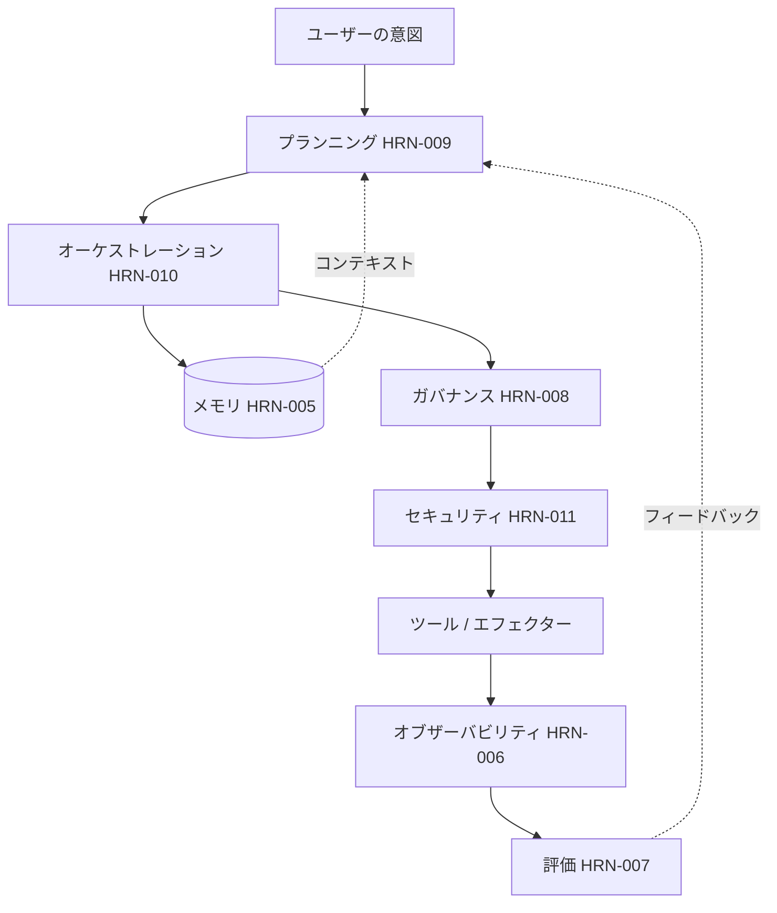

# ハーネスエンジニアリング (Harness Engineering)におけるケーススタディ

## エグゼクティブサマリー

本章では、抽象的なハーネスレイヤーを3つのエンドツーエンドのストーリーに基づいて具体化します。それぞれは、業界全体の共通パターンから合成された**代表的かつ匿名化された複合事例**であり、特定のデプロイメントの実績報告や検証済みメトリクスのソースではありません。その目的は、負荷がかかった状態で各レイヤーがどのように相互作用するかを示すことです。つまり、メモリ、プランニング、オーケストレーション、ガバナンス、セキュリティ、オブザーバビリティが個別の章ではなく、1つのシステムとしてどのように機能するかを示します。これらの事例を総合すると、エンタープライズエージェントにおける信頼性はモデルの創発的特性ではなく、ハーネスのエンジニアリング特性であるというテーゼが補強されます。

## 重要な概念

- **複合ケーススタディ:** 繰り返し発生する実世界のパターンから構築された説明用のシナリオであり、検証済みの単一のデプロイメントではないことを明示しているもの。
- **エンドツーエンド:** 意図の取り込みから、検証および統制されたアクション、および観察に至るまでをカバーすること。
- **ハーネスレイヤーの相互作用:** メモリ、プランニング、オーケストレーション、ガバナンス、セキュリティ、オブザーバビリティがどのように構成されるか。

## 定義

> **ハーネスエンジニアリングのケーススタディ**とは、エージェントシステムのすべてのレイヤーを通じて目標を追跡し、信頼性を決定づける設計上の決定、失敗モード、およびトレードオフを明らかにする構造化されたナラティブ（物語）です。

## アーキテクチャ図

## 詳細な説明

### ケーススタディ 1 — 財務オペレーション: 照合エージェント

> 代表的な複合事例。検証済みのメトリクスはありません。範囲は説明用です。

**目標。** 厳格な支出権限のもと、2つの元帳間で日次の取引を自律的に照合し、不一致を解消する。

**ハーネス設計。** プランニング（HRN-009）は、目標をDAG（有向非巡回グラフ）に分解します（抽出、照合、不一致の分類、解消、レポート）。オーケストレーション（HRN-010）は、これを**耐久性のあるワークフローエンジン**上で実行するため、夜間にクラッシュが発生しても、再起動するのではなく最後のチェックポイントから再開されます。これは、一部の解消ステップが資金移動を伴い、決して二重実行されてはならないため極めて重要です（べき等性キー ＋ Sagaパターンによる補償トランザクション）。ガバナンス（HRN-008）は、しきい値を超える解消アクションに対して**承認ゲート**を配置します。しきい値未満であれば、エージェントは完全な監査ログを記録しながら自律的に動作します。メモリ（HRN-005）は、照合ルールと過去の解決策の先例を保持します。オブザーバビリティ（HRN-006）は、すべての照合決定をトレースします。

**成果（説明用）。** エージェントは、些細な不一致のロングテールを自律的に解消し、重大な不一致をエスカレーションします。これにより、人間の労力は照合を「行う」ことから、例外を「承認する」ことへと移行します。**教訓:** 耐久性とべき等性がシステムを支える決定的な要因であり、「インテリジェンス」の部分は容易な部類でした。

### ケーススタディ 2 — カスタマーサポート: 解決エージェント

> 代表的な複合事例。検証済みのメトリクスはありません。範囲は説明用です。

**目標。** 顧客データの相互漏洩や、チケットの内容によるハイジャックを完全に防ぎながら、インバウンドのサポートチケットをエンドツーエンドで解決する（質問への回答、アカウントの更新、少額のクレジット発行など）。

**ハーネス設計。** これは**セキュリティファースト**のハーネス（HRN-011）です。各エージェントインスタンスは*リクエスト元の顧客*の認可情報を保持するため、データ分離はプロンプトではなく、モデルより下のレイヤーで強制されます。検索されたナレッジベースやチケットの内容は信頼できないものとして扱われます。**送信（エグレス）は許可リスト化**され、送信メッセージはDLP（データ流出防止）を通過します。これにより、インジェクション検出が試みを検知し損ねた場合でも、致命的な3つの脅威（lethal trifecta）を断ち切ります。シングルエージェントトポロジー（HRN-010）によってシンプルさを維持し、リフレクションステップ（PAT-003スタイルの自己チェック）が送信前に下書きされた返信をレビューします。ガバナンスは、少額のしきい値を超えるクレジット発行を人間の承認に回します。

**成果（説明用）。** ほとんどのチケットは人間の手を介さずに解決されます。チケット内のインジェクションの試みは、その*影響*が単なる検出だけでなく、権限と送信制御によって制限されているため、被害をもたらすことはありません。**教訓:** アーキテクチャによるセキュリティが分類器によるセキュリティに勝りました。勝利の要因は、ハイジャックされたエージェントが「実行可能なこと」を制限したことにあります。

### ケーススタディ 3 — ナレッジワーク: 調査・統合エージェント

> 代表的な複合事例。検証済みのメトリクスはありません。範囲は説明用です。

**目標。** 大規模なコーパスに対して、引用付きの信頼できる統合情報を用いて、複雑な社内質問に回答する。

**ハーネス設計。** **スーパーバイザー／ワーカー**トポロジー（HRN-010、PAT-002 ＋ PAT-005）を採用しています。スーパーバイザーが質問を分解し、並行して検索および分析を行うワーカーをディスパッチし、アグリゲーターがそれらの調査結果を引用付きの回答に統合します。メモリ（HRN-005）は検索コンテキストを提供し、初期の検索で何が明らかになるかによって経路が変化するため、プランニング（HRN-009）がインターリーブ（交互配置）されます。評価（HRN-007）は、LLM-as-judgeによるグラウンデッドネス（根拠性）チェックを実行し、*主張に引用がない場合は回答を不合格*とし、再プランニングにフィードバックします。オブザーバビリティはファンアウトをトレースするため、ワーカーごとのコストとレイテンシが可視化されます。

**成果（説明用）。** 並行ファンアウトは、トークン消費量が増加する代わりに、逐次的な調査と比較してレイテンシを改善します。グラウンデッドネスゲートこそが、出力を本番提供できるほど十分に信頼できるものにしている要因です。**教訓:** ここでマルチエージェントがその複雑さに見合う価値を発揮したのは、マルチエージェントが本質的に優れているからではなく、具体的には*並行性*と回答前の検証の必要性があったためです。

### 横断的な観察事項

3つの事例すべてにおいて、同じ真実が繰り返し現れます。(1) 要件を満たす最もシンプルなトポロジーが勝利すること、(2) 長時間実行されるエージェントが本番環境レベルであるかどうかを決定するのは、賢さではなく耐久性とべき等性であること、(3) ガバナンスとセキュリティはドキュメントではなく*ランタイム*レイヤーであること、(4) アクション前の検証（評価）こそが、もっともらしい出力を信頼できる出力に変換するものであること。これらはリファレンスアーキテクチャ（ARCH-001、ARCH-002）に関連しており、HRN-001の核心的なテーゼである「信頼性はハーネスに組み込まれるものである」という点を再確認するものです。

## 本番環境でのエビデンス

> **説明用／代表的なシナリオ。** エビデンスレベル: 理論的 · 確信度: 中 · 情報源: 業界の観察、個人の経験。3つのケーススタディはすべて、繰り返し発生するパターンから構築された匿名化された複合事例です。これらには、検証済みの単一の本番デプロイメントからの測定値は含まれておらず、数値はすべて説明用の範囲です。

- **コンテキスト:** 財務オペレーション、カスタマーサポート、およびエンタープライズナレッジワーク。
- **シナリオ:** 実際のエンタープライズ制約（支出権限、データ分離、引用の信頼性）の下でのエンドツーエンドのエージェント自動化。
- **テクノロジー:** 耐久性のあるワークフローエンジン、スコープ限定されたエージェントアイデンティティ、送信許可リスト、スーパーバイザー／ワーカーオーケストレーション、LLM-as-judge評価。
- **結果:** 方向性および定性的なもの。ベンチマークされた成果を主張するものではなく、設計上のトレードオフを説明するために提示されています。

### 得られた教訓

繰り返し得られる教訓は「抑制」です。成功したチームは、特定の要件がそれを正当化する場合に*のみ*複雑さ（マルチエージェント、自律性）を追加し、本番環境で機能するかどうかを決定づける地味なレイヤー（耐久性、アイデンティティ、監査）に早期に投資していました。

## 観察された失敗モード

| 事例 | 主な失敗モード | 決定的な緩和策 |
|---|---|---|
| 照合 | 再開時に資金移動ステップを二重実行してしまう | べき等性キー ＋ Sagaパターンによる補償トランザクション |
| サポート | 注入されたチケット内容を介したデータ流出 | ユーザー委任認可 ＋ 送信許可リスト ＋ DLP |
| 調査 | 裏付けのない主張が事実として提示される | 回答前のグラウンデッドネス評価ゲート |

## KPI

| メトリクス | 照合 | サポート | 調査 |
|---|---|---|---|
| タスク完了率 | 高（エスカレーションあり） | 高 | 高 |
| 人の手の介入率 | 低（例外のみ） | 低 | 中（レビュー） |
| 安全性インシデント率 | → 0（支出制限あり） | → 0（影響範囲の限定） | → 0（引用のみ） |
| レイテンシ | バッチ許容 | インタラクティブ | ファンアウトにより改善 |
| タスクあたりのコスト | 低 | 低 | 高（マルチエージェント） |

## コストメトリクス

- **照合:** タスクあたり安価（シングルエージェント、確定的）。主なコストは人間による例外の承認。
- **サポート:** タスクあたり安価。ガードレール／DLPの推論が限界的な追加コスト。
- **調査:** マルチエージェントのトークン消費によりタスクあたり最高コスト。並行レイテンシと検証された品質によって正当化される。

## スケーリング特性

シングルエージェントの事例（照合、サポート）は、外部ツールのレート制限や人間の承認能力によって制限されるものの、水平方向に安価にスケールします。マルチエージェントの調査事例は、共有検索のレート制限に達するまでサブタスクを並行してスケールさせますが、ワーカーが追加されるごとにトークンコストが増加します。これは、マルチエージェントを採用する価値があるかどうかを定義する、古典的な「レイテンシ対コスト」のトレードオフです。

## 関連コンテンツ

- ARCH-001 — シングルエージェントの耐久性のあるワークフローを例示するリファレンスアーキテクチャ。
- ARCH-002 — スーパーバイザー／ワーカーオーケストレーションを例示するリファレンスアーキテクチャ。
- HRN-001 — 定義と概要（これらの事例が補強するテーゼ）。

## 参考文献

- Anthropic、「Building Effective Agents」およびマルチエージェント調査システムの解説記事。
- 耐久性のあるエージェントワークフローに関する業界のポストモーテム（事後分析）およびアーキテクチャ解説記事。
- これらの事例が構成するハーネスの章（HRN-005からHRN-011）。

## FAQ

**Q: これらは実際のデプロイメントですか？**
**A: いいえ。これらは繰り返し発生する業界のパターンから構築された匿名化された複合事例であり、設計上のトレードオフを説明するために提示されています。検証済みの本番メトリクスは含まれていません。**

**Q: 最も応用可能な単一の教訓は何ですか？**
**A: 要件が要求する場合にのみ複雑さを追加し、まずは耐久性、アイデンティティ、監査に投資することです。これらは、エージェントが本番環境で存続できるかどうかを決定づけるレイヤーです。**

**Q: なぜケース3にのみマルチエージェントを含めているのですか？**
**A: 並行性と検証が調整コストを正当化できたのが、そのケースのみであったためです。他のケースは意図的にシングルエージェントにしています。**
