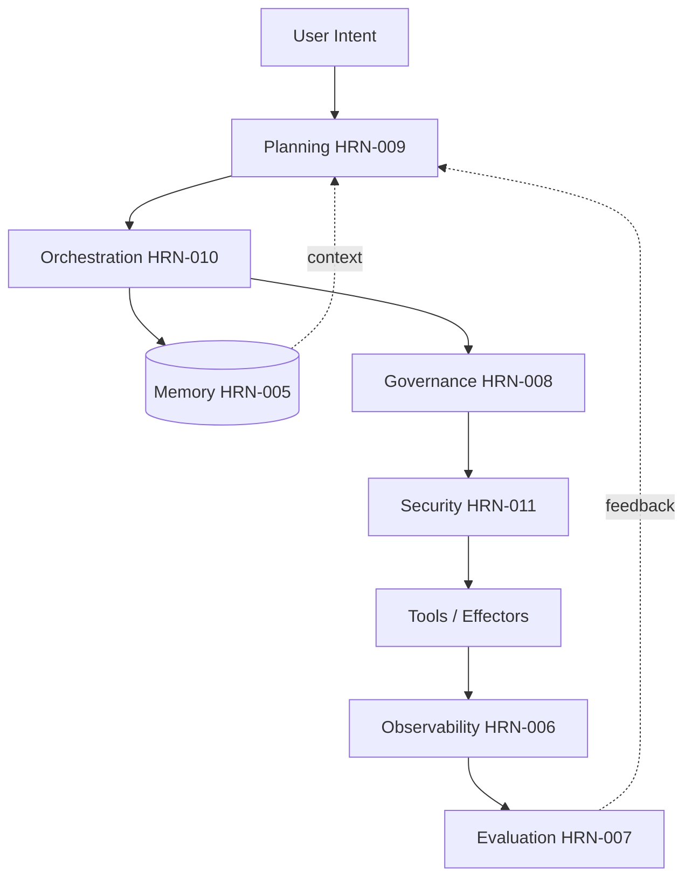

# Case Studies in Harness Engineering

## Executive Summary

This chapter grounds the abstract harness layers in three end-to-end stories. Each is a **representative, anonymized composite** — synthesized from common patterns across the industry, not an account of a single named deployment, and not a source of verified metrics. The point is to show how the layers interact under load: how memory, planning, orchestration, governance, security, and observability stop being separate chapters and become one system. Read together, the cases reinforce the thesis that reliability in enterprise agents is an engineering property of the harness, not an emergent property of the model.

## Key Concepts

- **Composite case study:** an illustrative scenario assembled from recurring real-world patterns, explicitly not a verified single deployment.
- **End-to-end:** spanning ingestion of intent through verified, governed action and observation.
- **Harness layer interaction:** how memory, planning, orchestration, governance, security, and observability compose.

## Definition

> A **harness engineering case study** is a structured narrative that traces a goal through every layer of an agentic system to expose the design decisions, failure modes, and trade-offs that determine reliability.

## Architecture Diagram

## Detailed Explanation

### Case Study 1 — Financial Operations: the Reconciliation Agent

> Representative composite. No verified metrics; ranges are illustrative.

**Goal.** Autonomously reconcile daily transactions across two ledgers and remediate discrepancies under a strict spend authority.

**Harness design.** Planning (HRN-009) decomposes the goal into a DAG: extract, match, classify discrepancies, remediate, report. Orchestration (HRN-010) runs it on a **durable workflow engine** so an overnight crash resumes from the last checkpoint rather than restarting — critical because some remediation steps move money and must never double-execute (idempotency keys + saga compensation). Governance (HRN-008) places an **approval gate** on any remediation above a threshold; below it, the agent acts autonomously with full audit logging. Memory (HRN-005) holds reconciliation rules and prior-resolution precedents. Observability (HRN-006) traces every match decision.

**Outcome (illustrative).** The agent clears the long tail of trivial discrepancies autonomously and escalates the consequential ones, shifting human effort from *doing* reconciliation to *approving* exceptions. **Lesson:** durability + idempotency were the load-bearing decisions; the "intelligence" was the easy part.

### Case Study 2 — Customer Support: the Resolution Agent

> Representative composite. No verified metrics; ranges are illustrative.

**Goal.** Resolve inbound support tickets end-to-end — answer questions, update accounts, issue small credits — while never leaking one customer's data to another and never being hijacked by ticket content.

**Harness design.** This is a **security-first** harness (HRN-011). Each agent instance carries the *requesting customer's* authorization, so data isolation is enforced below the model, not by prompting. Retrieved knowledge-base and ticket content is treated as untrusted; **egress is allowlisted** and outbound messages pass DLP — breaking the lethal trifecta even when injection detection misses an attempt. A single-agent topology (HRN-010) keeps it simple; a reflection step (PAT-003-style self-check) reviews the drafted reply before send. Governance gates credits above a small threshold to a human.

**Outcome (illustrative).** Most tickets resolve without human touch; injection attempts in tickets fail to cause harm because the *consequence* is bounded by permissions and egress control, not merely by detection. **Lesson:** architectural security beat classifier security; the win came from constraining what a hijacked agent *could* do.

### Case Study 3 — Knowledge Work: the Research-and-Synthesis Agent

> Representative composite. No verified metrics; ranges are illustrative.

**Goal.** Answer complex internal questions with cited, trustworthy synthesis over a large corpus.

**Harness design.** A **supervisor/worker** topology (HRN-010, PAT-002 + PAT-005): the supervisor decomposes the question and dispatches parallel retrieval and analysis workers, then an aggregator reconciles their findings into a cited answer. Memory (HRN-005) supplies retrieval context; planning (HRN-009) is interleaved because the path depends on what early retrieval surfaces. Evaluation (HRN-007) runs an LLM-as-judge groundedness check that *fails the answer if claims aren't cited*, feeding back into a replan. Observability traces the fan-out so cost and latency per worker are visible.

**Outcome (illustrative).** Parallel fan-out improves latency over sequential research at the cost of higher token spend; the groundedness gate is what makes the output trustworthy enough to ship. **Lesson:** multi-agent earned its complexity here specifically because of *parallelism* and the need to verify before answering — not because multi-agent is inherently better.

### Cross-cutting observations

Across all three, the same truths recur: (1) the simplest topology that meets the requirement wins; (2) durability and idempotency, not cleverness, decide whether a long-running agent is production-grade; (3) governance and security are *runtime* layers, not documents; (4) verification (evaluation) before action is what converts plausible output into trustworthy output. These connect to the reference architectures (ARCH-001, ARCH-002) and restate the core thesis of HRN-001: reliability is engineered into the harness.

## Production Evidence

> **Illustrative / representative scenarios.** Evidence level: theoretical · Confidence: medium · Source: industry_observation, personal_experience. All three case studies are anonymized composites assembled from recurring patterns. They contain no measurements from any single verified production deployment, and any quantities are illustrative ranges.

- **Context:** Financial operations, customer support, and enterprise knowledge work.
- **Scenario:** End-to-end agentic automation under real enterprise constraints (spend authority, data isolation, citation trust).
- **Technology:** Durable workflow engines, scoped agent identity, egress allowlists, supervisor/worker orchestration, LLM-as-judge evaluation.
- **Results:** Directional and qualitative; presented to illustrate design trade-offs, not to assert benchmarked outcomes.

### Lessons Learned

The recurring lesson is restraint: teams that succeeded added complexity (multi-agent, autonomy) *only* where a specific requirement justified it, and invested early in the unglamorous layers — durability, identity, audit — that determine whether anything works in production.

## Observed Failure Modes

| Case | Dominant Failure Mode | Decisive Mitigation |
|---|---|---|
| Reconciliation | Double-executing a money-moving step on resume | Idempotency keys + saga compensation |
| Support | Data exfiltration via injected ticket content | User-delegated authZ + egress allowlist + DLP |
| Research | Unsupported claims presented as fact | Groundedness eval gate before answer |

## KPIs

| Metric | Reconciliation | Support | Research |
|---|---|---|---|
| Task completion rate | High (with escalation) | High | High |
| Human-touch rate | Low (exceptions only) | Low | Moderate (review) |
| Safety incident rate | → 0 (gated spend) | → 0 (bounded blast radius) | → 0 (cited only) |
| Latency | Batch-tolerant | Interactive | Improved by fan-out |
| Cost per task | Low | Low | Higher (multi-agent) |

## Cost Metrics

- **Reconciliation:** cheap per task (single agent, deterministic); dominant cost is human approval of exceptions.
- **Support:** cheap per task; guardrail/DLP inference is the marginal add.
- **Research:** highest per task due to multi-agent token spend; justified by parallel latency and verified quality.

## Scaling Characteristics

The single-agent cases (reconciliation, support) scale horizontally and cheaply, bounded by external-tool rate limits and human approval capacity. The multi-agent research case scales sub-tasks in parallel up to shared-retrieval rate limits, with token cost growing per added worker — the classic latency-vs-cost trade that defines when multi-agent is worth it.

## Related Content

- ARCH-001 — Reference architecture exemplifying single-agent durable workflows.
- ARCH-002 — Reference architecture exemplifying supervisor/worker orchestration.
- HRN-001 — Definition and Overview (the thesis these cases reinforce).

## References

- Anthropic, "Building Effective Agents" and multi-agent research-system writeups.
- Industry post-mortems and architecture writeups on durable agentic workflows.
- The harness chapters HRN-005 through HRN-011, which these cases compose.

## FAQs

**Q: Are these real deployments?**
A: No. They are anonymized composites assembled from recurring industry patterns, presented to illustrate design trade-offs. They contain no verified production metrics.

**Q: What is the single most transferable lesson?**
A: Add complexity only where a requirement demands it, and invest first in durability, identity, and audit — the layers that decide whether an agent survives production.

**Q: Why include multi-agent only in case 3?**
A: Because that is the only case where parallelism and verification justified the coordination cost. The others are deliberately single-agent.
