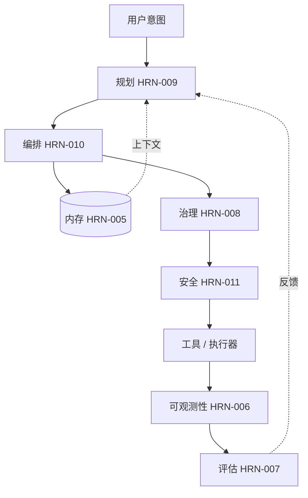

# Harness Engineering（智能体支撑系统工程）案例研究

## 执行摘要

本章将抽象的支撑系统层落地于三个端到端的故事中。每一个案例都是一个**具有代表性的、匿名的综合体**——由行业内的常见模式合成，而非单一具体部署的记录，也不作为已验证指标的来源。其目的是展示各层在负载下是如何交互的：内存、规划、编排、治理、安全和可观测性如何不再是独立的章节，而是融为一个系统。通读这些案例可以强化这样一个论点：企业级智能体（agent）的可靠性是支撑系统（harness）的一种工程属性，而不是模型的一种涌现属性。

## 核心概念

- **综合案例研究：** 由循环出现的真实世界模式构建的说明性场景，明确指出并非经过验证的单一部署。
- **端到端：** 跨越从意图输入到经验证、受治理的操作和观测的全过程。
- **支撑系统层交互：** 内存、规划、编排、治理、安全和可观测性如何协同组合。

## 定义

> **Harness Engineering 案例研究**是一个结构化的叙述，它追踪智能体系统（agentic system）中每个层面的目标，以揭示决定可靠性的设计决策、失效模式和权衡取舍。

## 架构图

## 详细说明

### 案例研究 1 —— 金融运营：对账智能体

> 代表性综合案例。无验证指标；范围仅作说明之用。

**目标。** 在严格的支出授权下，自主核对两个账本之间的每日交易并纠正差异。

**支撑系统设计。** 规划（HRN-009）将目标分解为一个 DAG：提取、匹配、分类差异、纠正、报告。编排（HRN-010）在**持久化工作流引擎**上运行它，以便夜间崩溃时能从上一个检查点恢复，而不是重新启动——这至关重要，因为某些纠正步骤涉及资金转移，绝不能重复执行（幂等键 + Saga 补偿机制）。治理（HRN-008）对任何超过阈值的纠正操作设置了**审批关卡**；在阈值以下，智能体自主运行并记录完整的审计日志。内存（HRN-005）保存对账规则和先前的解决先例。可观测性（HRN-006）追踪每一次匹配决策。

**结果（说明性）。** 智能体自主清除长尾的琐碎差异，并升级上报重要差异，将人力投入从*执行*对账转变为*审批*异常。**启示：** 持久性 + 幂等性是起承重作用的决策；“智能”反而是容易的部分。

### 案例研究 2 —— 客户支持：解决智能体

> 代表性综合案例。无验证指标；范围仅作说明之用。

**目标。** 端到端解决入站支持工单——回答问题、更新账户、发放小额退款——同时绝不将一个客户的数据泄露给另一个客户，且绝不被工单内容劫持。

**支撑系统设计。** 这是一个**安全第一**的支撑系统（HRN-011）。每个智能体实例都携带*发起请求的客户*的授权，因此数据隔离是在模型之下强制执行的，而不是通过提示词。检索到的知识库和工单内容被视为不可信；**出口流量被列入白名单**，且出站消息需通过 DLP——即使注入检测漏掉了某次尝试，也能打破致命的三元组。单智能体拓扑（HRN-010）保持了架构的简单性；反射步骤（PAT-003 风格的自检）在发送前审查起草的回复。治理机制将超过小额阈值的退款关卡交由人工处理。

**结果（说明性）。** 大多数工单无需人工干预即可解决；工单中的注入尝试未能造成危害，因为*后果*受到权限和出口控制的限制，而不仅仅依赖于检测。**启示：** 架构安全战胜了分类器安全；胜利源于限制被劫持的智能体*能够*做什么。

### 案例研究 3 —— 知识工作：研究与合成智能体

> 代表性综合案例。无验证指标；范围仅作说明之用。

**目标。** 针对大型语料库，通过有引用、可信赖的合成来回答复杂的内部问题。

**支撑系统设计。** 一种**主管/协作者**拓扑（HRN-010，PAT-002 + PAT-005）：主管分解问题并分派并行的检索和分析协作者，然后聚合器将他们的发现调和成带有引用的回答。内存（HRN-005）提供检索上下文；规划（HRN-009）是交织进行的，因为路径取决于早期检索呈现的内容。评估（HRN-007）运行 LLM-as-judge 的真实性（groundedness）检查，*如果主张没有引用，则判定回答不合格*，并反馈到重新规划中。可观测性追踪扇出过程，使每个协作者的成本和延迟可见。

**结果（说明性）。** 与顺序研究相比，并行扇出改善了延迟，代价是更高的 Token 消耗；真实性关卡是使输出足够可信以交付的关键。**启示：** 多智能体在此处之所以值得其带来的复杂性，正是因为*并行性*以及在回答前进行验证的需求——而不是因为多智能体本身更好。

### 跨领域观察

在这三个案例中，反复印证了相同的真理：（1）满足需求的最简单拓扑获胜；（2）决定长期运行的智能体是否达到生产级的是持久性和幂等性，而不是聪明程度；（3）治理和安全是*运行时*层，而不是文档；（4）行动前的验证（评估）是将看似合理的输出转化为可信输出的关键。这些与参考架构（ARCH-001、ARCH-002）相联系，并重申了 HRN-001 的核心论点：可靠性是通过工程手段构建到支撑系统中的。

## 生产证据

> **说明性/代表性场景。** 证据级别：理论 · 置信度：中 · 来源：行业观察、个人经验。所有三个案例研究都是由循环出现的模式构建的匿名综合体。它们不包含来自任何单一经验证生产部署的测量数据，任何数量均为说明性范围。

- **背景：** 金融运营、客户支持和企业知识工作。
- **场景：** 真实企业约束（支出授权、数据隔离、引用信任）下的端到端智能体自动化。
- **技术：** 持久化工作流引擎、限定范围的智能体身份、出口白名单、主管/协作者编排、LLM-as-judge 评估。
- **结果：** 方向性和定性的；旨在说明设计权衡，而非断言基准测试结果。

### 经验教训

反复出现的教训是克制：成功的团队*仅在*特定需求合理时才增加复杂性（多智能体、自主性），并尽早投资于那些决定生产环境中一切能否正常运行的、不起眼的层面——持久性、身份、审计。

## 观察到的失效模式

| 案例 | 主要失效模式 | 决定性缓解措施 |
|---|---|---|
| 对账 | 恢复时重复执行资金转移步骤 | 幂等键 + Saga 补偿机制 |
| 支持 | 通过注入的工单内容泄露数据 | 用户委托授权（authZ） + 出口白名单 + DLP |
| 研究 | 无支持的主张被当作事实呈现 | 回答前的真实性评估关卡 |

## 关键绩效指标（KPI）

| 指标 | 对账 | 支持 | 研究 |
|---|---|---|---|
| 任务完成率 | 高（含升级上报） | 高 | 高 |
| 人工干预率 | 低（仅限异常） | 低 | 中等（审查） |
| 安全事件率 | → 0（受控支出） | → 0（受限爆炸半径） | → 0（仅限引用） |
| 延迟 | 容忍批处理 | 交互式 | 通过扇出改善 |
| 每次任务成本 | 低 | 低 | 较高（多智能体） |
n## 成本指标

- **对账：** 每次任务成本低（单智能体，确定性）；主要成本是人工审批异常。
- **支持：** 每次任务成本低；护栏/DLP 推理是边际增加项。
- **研究：** 由于多智能体 Token 消耗，每次任务成本最高；因并行延迟 and 经验证的质量而显得合理。

## 扩展特性

单智能体案例（对账、支持）可以水平且廉价地扩展，受限于外部工具的速率限制和人工审批能力。多智能体研究案例在并行的子任务中扩展，直至达到共享检索速率限制，Token 成本随着新增协作者而增加——这是定义多智能体何时值得的经典“延迟 vs 成本”权衡。

## 相关内容

- ARCH-001 —— 示例单智能体持久化工作流的参考架构。
- ARCH-002 —— 示例主管/协作者编排的参考架构。
- HRN-001 —— 定义与概述（这些案例所强化的论点）。

## 参考文献

- Anthropic，“构建高效智能体”（Building Effective Agents）及多智能体研究系统报告。
- 关于持久化智能体工作流的行业事后分析和架构报告。
- 支撑系统章节 HRN-005 至 HRN-011，这些案例由其组合而成。

## 常见问题

**问：这些是真实的部署吗？**
答：不是。它们是由循环出现的行业模式构建的匿名综合体，旨在说明设计权衡。它们不包含任何经验证的生产指标。

**问：最具有可借鉴意义的单一教训是什么？**
答：仅在需求需要时才增加复杂性，并首先投资于持久性、身份和审计——这些是决定智能体能否在生产环境中生存下来的层面。

**问：为什么仅在案例 3 中包含多智能体？**
答：因为那是唯一一个并行性和验证能够证明协调成本合理的案例。其他案例刻意采用了单智能体。
